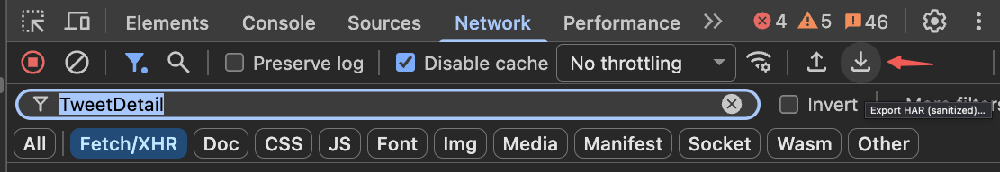

# fetch-tianyicui-x

从 X（Twitter）帖子抓包 HAR 中，提取帖子下所有回复提到的开源项目链接，并整理为结构化表格。

仓库地址：[Hyperstatics/fetch-tianyicui-x](https://github.com/Hyperstatics/fetch-tianyicui-x.git)

## 背景

源帖：[@tianyi](https://x.com/tianyi) 发布
[「如果你是 Agent Harness 相关开源项目的开发者，希望参加 DeepSeek Harness 的内测，请附上 GitHub id 以及开源代表作」](https://x.com/tianyi/status/2083519855203078320)。

本帖把回复中大家提到的开源项目链接全部提取出来，便于汇总、筛选和跟进。

## 数据来源

- `x.com.har`：浏览器开发者工具导出的 HAR 抓包，包含 11 个 `TweetDetail` GraphQL 分页响应（原帖 + 回复 + 引用）。

> [!IMPORTANT]
> HAR 文件包含会话相关请求头和第三人公开数据（见「安全说明」），**已通过 `.gitignore` 排除，不会提交到仓库**。请自行抓取后放到项目根目录。

### 获取 HAR

用浏览器 Network 面板保存 HAR：

1. 打开帖子页面：https://x.com/tianyi/status/2083519855203078320
2. 按 `F12` 打开开发者工具
3. 切换到 **Network** 面板
4. 类型过滤选择 **fetch/xhr**
5. 筛选框输入 **TweetDetail**
6. 滚动帖子页面，加载更多回复（会持续产生 `TweetDetail` 请求）
7. 右键任意请求 → **Export HAR**（或点导出按钮）
8. 保存为 `x.com.har`，放到项目根目录



## 处理流程

```text
x.com.har
  -> 提取所有 TweetDetail response
  -> base64 解码（响应正文是 base64 编码的 JSON）
  -> 递归遍历 threaded_conversation_with_injections_v2 中的推文节点
  -> 读取 full_text、entities 中的 expanded_url / display_url / url
  -> 过滤仓库托管平台域名（GitHub / GitLab / Hugging Face / Gitee / Codeberg 等）
  -> 按 (推文, 链接) 去重
  -> projects.csv
```

## 输出：projects.csv

| 字段 | 说明 |
| --- | --- |
| `tweet_id` | 推文 ID |
| `created_at` | 发帖时间（X 原始格式） |
| `screen_name` | 作者 X 用户名 |
| `display_name` | 作者显示名 |
| `tweet_text` | 推文全文 |
| `url` | 开源项目链接 |
| `kind` | `repo`（仓库）/ `profile`（GitHub 个人主页） |
| `repo` | 规范化的 `owner/repo`（仅仓库链接） |

文件编码为 UTF-8 with BOM，可直接用 Excel 打开。

## 统计

当前 HAR（抓取时间 2026-08-03）：

- 解析推文：311 条（含原帖、回复、引用推文）
- 提供链接的作者：243 位
- 链接行数：277 行，去重后 276 个唯一链接
  - 仓库链接：242 个
  - GitHub 个人主页：35 个
- 当前数据中仅出现 GitHub 链接；脚本同时支持 GitLab / Hugging Face / Gitee / Codeberg / Bitbucket / SourceForge / GitCode 等域名，重新抓包后可直接复用。

## 使用

确保 `x.com.har` 已按上述步骤放在项目根目录，然后运行：

```bash
python3 extract_projects.py
```

脚本会重新读取 `x.com.har` 并覆盖生成 `projects.csv`。

## 目录结构

```text
.
├── x.com.har            # 原始抓包（本地文件，不入库，见 .gitignore）
├── har-screenshot.png   # 抓取方法示意图
├── extract_projects.py  # 提取脚本
├── projects.csv         # 提取结果
├── LICENSE              # MIT License
├── .gitignore           # 排除 HAR 等敏感文件
└── README.md
```

## License

代码部分基于 [MIT License](LICENSE) 开源。

`projects.csv` 中的链接与文本来自公开帖子回复，收录不代表背书；数据使用请遵守 X 平台服务条款，并自行确认各项目的授权情况。

## 说明

- **安全说明**：HAR 包含绑定会话的 `x-csrf-token` 等请求头，以及回复者的公开账号与发言内容，请勿提交到仓库或公开分享原始文件。
- 项目链接未逐一验证可达性与维护状态，收录不代表背书。
- 本仓库仅做数据整理，与 DeepSeek、X 无官方关联。
